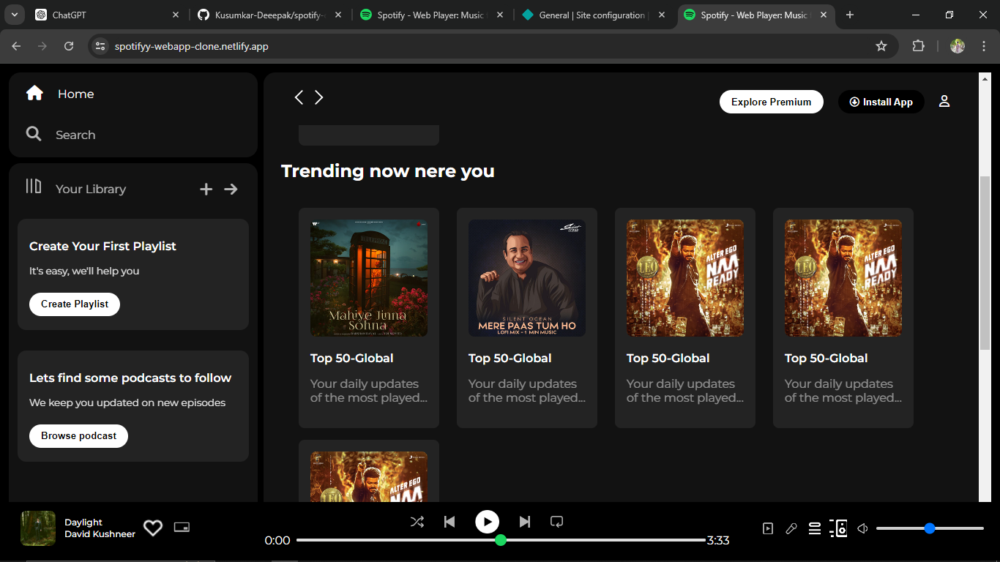

# Spotify Clone Webapp

This repository contains a simple Spotify clone web application created using HTML and CSS. The purpose of this project is to replicate the basic UI of Spotify for educational purposes.

## Table of Contents
- [Demo](#demo)
- [Features](#features)
- [Screenshots](#screenshots)
- [Installation](#installation)
- [Usage](#usage)
- [Contributing](#contributing)
- [License](#license)
- [Contact](#contact)

## Demo
You can view a live demo of the Spotify Clone Webapp [here](https://spotifyy-webapp-clone.netlify.app/).

## Features
- Responsive design that mimics the Spotify web player
- Home page with a playlist overview
- Sidebar navigation similar to Spotify
- Basic styling of player controls

## Screenshots

Here are some screenshots of the iCoder platform. If the images are not displaying, please check the `Screenshots` folder in the repository.

### Screenshot 1
 - 

### Screenshot 2


### Screenshot 3


## Installation
To get a local copy up and running follow these simple steps.

1. Clone the repository:
    ```sh
    git clone https://github.com/your-username/spotify-clone-webapp.git
    ```

2. Open the project directory:
    ```sh
    cd spotify-clone-webapp
    ```

## Usage
Open the `index.html` file in your favorite web browser to see the Spotify clone in action.

## Contributing
Contributions are what make the open-source community such an amazing place to learn, inspire, and create. Any contributions you make are **greatly appreciated**.

1. Fork the Project
2. Create your Feature Branch (`git checkout -b feature/AmazingFeature`)
3. Commit your Changes (`git commit -m 'Add some AmazingFeature'`)
4. Push to the Branch (`git push origin feature/AmazingFeature`)
5. Open a Pull Request

## License
Distributed under the MIT License. See `LICENSE` for more information.

## Contact

My Name - Kusumkar Deepak Prakash.

My Email - [deeepak.kusumkar@gmail.com](deeepak.kusumkar@gmail.com)

Project Link: [https://github.com/your-username/spotify-clone-webapp](https://spotifyy-webapp-clone.netlify.app/)
